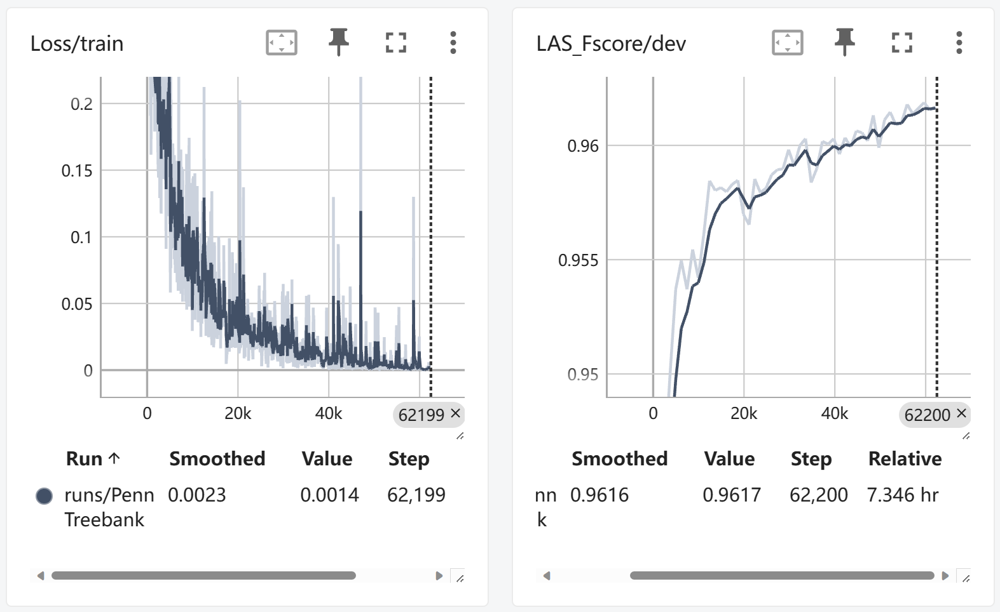
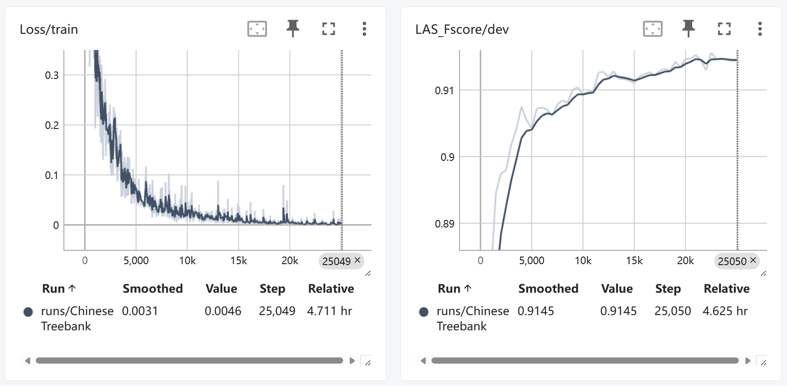
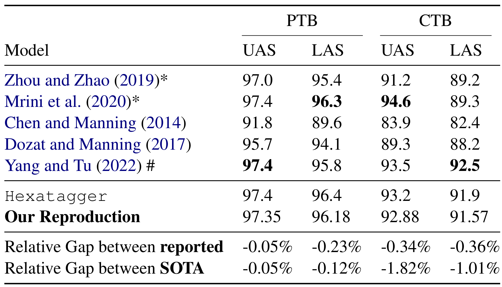

# Hexatagging: Projective Dependency Parsing as Tagging
<p align="center">
  
  
</p>
This repository contains reproduction code and scripts for paper: 

[Hexatagging: Projective Dependency Parsing as Tagging
](https://aclanthology.org/2023.acl-short.124/)

## Setting Up The Environment
Here we include more detailed steps on setting up the env. We encountered subtle errors using merely `pip install -r requirements.txt`.
```bash
# create conda env with python=3.10.13
conda create -n hexatag python=3.10.13 -y
conda activate hexatag

# install conda rust env to build `pytokenizations`
conda install -c conda-forge rust -y

# checkout https://pytorch.org/ to determine the right command for installing torch with cuda
pip install torch --index-url https://download.pytorch.org/whl/cu118

# install other requirements
pip install -r requirements.txt
```

## Getting The Data
### Initial Processing
The authors refer to instructions in [this repo](https://github.com/nikitakit/self-attentive-parser/tree/master/data) for initial preprocessing on the English WSJ and Chinese Treebank datasets. Here we list the steps relevant to our reproduction.
#### English WSJ

1. Place a copy of the Penn Treebank
([LDC99T42](https://catalog.ldc.upenn.edu/LDC99T42)) under `data/raw/treebank_3`.
After doing this, `data/raw/treebank_3/parsed/mrg/wsj` should have folders
named `00`-`24`.
2. Place a copy of the revised Penn Treebank
([LDC2015T13](https://catalog.ldc.upenn.edu/LDC2015T13)) under
`data/raw/eng_news_txt_tbnk-ptb_revised`.
3. `cd data/wsj && ./build_corpus.sh`

For a description of the generated files, please refer to [this file](./data/README.md)

#### Chinese Treebank (CTB 5.1)

This prepares the standard Chinese constituency parsing split, following recent papers such as [Liu and Zhang (2017)](https://www.aclweb.org/anthology/Q17-1004/).

1. Place a copy of the Chinese Treebank 5.1
([LDC2005T01](https://catalog.ldc.upenn.edu/LDC2005T01)) in `data/raw/ctb5.1_507K`.
2. `cd data/ctb_5.1 && ./build_corpus.sh`

For a description of the generated files, please refer to [this file](./data/README.md)

### Generating Binary-Headed-Trees
Convert CoNLL to Binary Headed Trees:

Comment out [this line](https://github.com/Ja1Zhou/hexatagger/blob/reproduce/data/dep2bht.py#L285) in `data/dep2bht.py` and use the following command.
```bash
# comment out line 285 in data/dep2bht.py beforehand
python data/dep2bht.py
```
This will generate the phrase-structured BHT trees in the `data/bht` directory. 
(The authors placed the processed files already under the `data/bht` directory.)

## Building The Tagging Vocab
In order to use taggers, we need to build the vocabulary of tags for in-order, pre-order and post-order linearizations. You can cache these vocabularies using:
```bash
python run.py vocab --lang [LANGUAGE] --tagger [TAGGER]
```

For our purposes, we specify tagger to be `hexa` and generate vocab for English and Chinese.
```bash
for lang in English Chinese; do
    python run.py vocab --lang $lang --tagger hexa
done
```

## Training
### PTB (English)
- Training Commands
```bash
CUDA_VISIBLE_DEVICES=0 python run.py train --lang English --max-depth 6 --tagger hexa --model bert --epochs 50 --batch-size 32 --lr 2e-5 --model-path xlnet-large-cased --output-path ./checkpoints/ --use-tensorboard True
# model saved at ./checkpoints/English-hexa-bert-2e-05-50
```
- Tensorboard Metrics ([view it on Huggingface](https://huggingface.co/JeremiahZ/Hexatagger_PTB/tensorboard))
<p align="center">
  
</p>

### CTB (Chinese)
- Training Commands
```bash
CUDA_VISIBLE_DEVICES=0 python run.py train --lang Chinese --max-depth 6 --tagger hexa --model bert --epochs 50 --batch-size 32 --lr 2e-5 --model-path hfl/chinese-xlnet-mid --output-path ./checkpoints/ --use-tensorboard True
# model saved at ./checkpoints/Chinese-hexa-bert-2e-05-50
```
- Tensorboard Metrics ([view it on Huggingface](https://huggingface.co/JeremiahZ/Hexatagger_CTB/tensorboard))
<p align="center">
  
</p>

### Trained Model Weights
We hold our trained model weights on Huggingface.
| Language | Train Dataset | Model Path |
| -------- | ---------- | ---------- |
| English  | Penn Treebank | [JeremiahZ/Hexatagger_PTB](https://huggingface.co/JeremiahZ/Hexatagger_PTB/) |
| Chinese | Chinese Treebank | [JeremiahZ/Hexatagger_CTB](https://huggingface.co/JeremiahZ/Hexatagger_CTB/) |


## Evaluation
### PTB
```bash
python run.py evaluate --lang English --max-depth 10 --tagger hexa --bert-model-path xlnet-large-cased --model-name English-hexa-bert-2e-05-50 --batch-size 64 --model-path ./checkpoints/
```

### CTB
```bash
python run.py evaluate --lang Chinese --max-depth 10 --tagger hexa --bert-model-path bert-base-chinese --model-name Chinese-hexa-bert-2e-05-50 --batch-size 64 --model-path ./checkpoints/
```
### Reproduced Results
<p align="center">
  
</p>

## Predict
### PTB
```bash
python run.py predict --lang English --max-depth 10 --tagger hexa --bert-model-path xlnet-large-cased --model-name English-hexa-bert-3e-05-50 --batch-size 64 --model-path ./checkpoints/
```

# Citing the Original Paper
```bibtex
@inproceedings{amini-etal-2023-hexatagging,
    title = "Hexatagging: Projective Dependency Parsing as Tagging",
    author = "Amini, Afra  and
      Liu, Tianyu  and
      Cotterell, Ryan",
    booktitle = "Proceedings of the 61st Annual Meeting of the Association for Computational Linguistics (Volume 2: Short Papers)",
    month = jul,
    year = "2023",
    address = "Toronto, Canada",
    publisher = "Association for Computational Linguistics",
    url = "https://aclanthology.org/2023.acl-short.124",
    pages = "1453--1464",
}
```